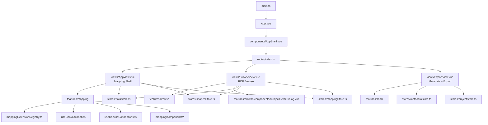
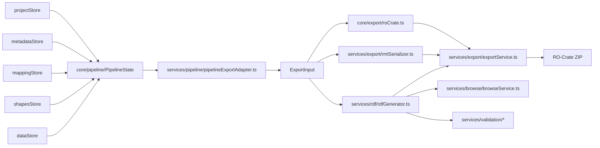

# Architecture Overview

This file is the quickest entry point for understanding the current ARDMP structure.

## Placement Rule For Vue Files

Do not collect all `.vue` files in one global `src/components` folder.

Use this ownership rule instead:

- `src/views`
  - route-level screens
- `src/components`
  - app-wide shared shell or UI used across unrelated features
- `src/features/<feature>/components`
  - UI owned by one feature
- `src/features/<feature>/...`
  - helpers, composables, and local wiring that belong to that feature

Current recommendation:

- keep [AppShell.vue](../src/components/AppShell.vue) in shared `components`
- keep mapping canvas/setup/preview components inside `src/features/mapping/components`
- keep browse-specific UI inside `src/features/browse/components`
- keep route screens in `src/views`

## High-Level Runtime

## Export And Validation Flow

## Layered Reading Order

For a new developer, this is the most useful reading order:

1. `src/router/index.ts`
2. `src/App.vue`
3. `src/views/AppView.vue`, `src/views/BrowseView.vue`, `src/views/ExportView.vue`
4. `src/stores/*`
5. `src/features/mapping/*` and `src/features/browse/*`
6. `src/services/pipeline/*`
7. `src/services/export/*`, `src/services/rdf/*`, `src/services/validation/*`
8. `src/domain/*`

## Current Structural Takeaway

The project is no longer best described as one big Vue app with helpers. It now reads more clearly as:

- app shell and route views
- feature-owned UI and workflows
- stores as runtime coordination
- services as business logic and export logic
- `PipelineState` as the explicit export seam

That is the structure new contributors should learn first.
